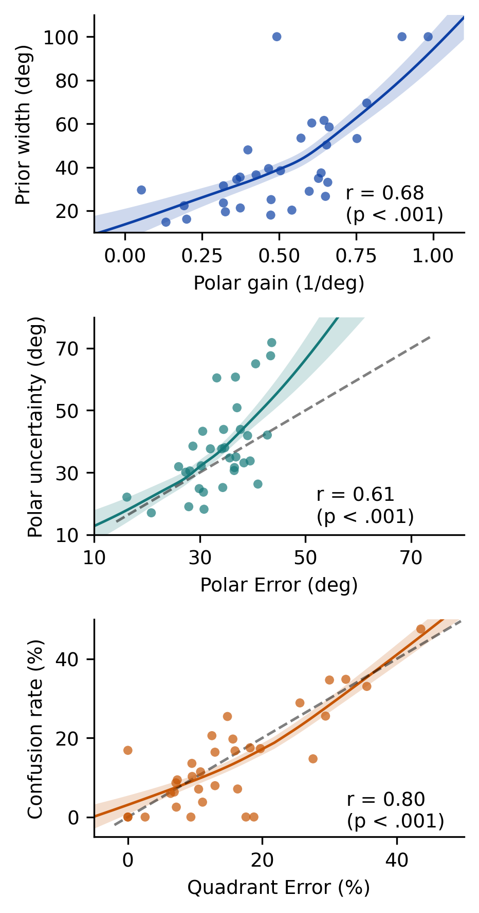

# fa2026-localisation-mixture

A probabilistic mixture model for evaluating sound localisation performance in
the median plane, together with the classical localisation metrics it is
compared against.

Companion code for

> J. Sztandera, L. Picinali and R. Barumerli, "A Probabilistic Mixture Model
> for Evaluating Sound Localisation Performance in the Median Plane",
> *Proceedings of Forum Acusticum 2026*, Graz.

[](https://github.com/robaru/fa2026-localisation-mixture/actions/workflows/ci.yml)
[](LICENSE)

## The model

Median-plane localisation is usually summarised with threshold-based metrics:
polar error (responses within 90° of the target), quadrant error rate
(responses beyond 90°) and polar gain. Each discards part of the data and
compresses individual differences. This repository fits the *whole* polar
response distribution instead.

For a target at polar angle φ_t, the response φ follows

```
p(φ | φ_t) ∝ [ w·VM(φ; φ_t, κ) + (1 − w)·VM(φ; π − φ_t, κ) ] × [ ½·VM(φ; 0, κ_P) + ½·VM(φ; π, κ_P) ]
```

where VM is the von Mises density. The three parameters are interpretable:

| Parameter | Reported as | Meaning | Classical counterpart |
|---|---|---|---|
| w | confusion rate 1 − w | probability of responding in the correct front/back hemifield | quadrant error rate |
| κ | σ (degrees) | precision of the polar response | polar error |
| κ_P | σ_P (degrees) | strength of a spatial prior pulling responses towards the horizontal plane (large σ_P = flat prior) | polar gain |

The product of von Mises densities is itself a mixture of four von Mises
components (von Mises addition theorem), so the likelihood is analytic and a
fit takes a fraction of a second with [pyBADS](https://github.com/acerbilab/pybads).
With κ_P → 0 the model reduces to the two-parameter mixture (w, κ).

## Install

```bash
git clone https://github.com/robaru/fa2026-localisation-mixture.git
cd fa2026-localisation-mixture
pip install -r requirements.txt        # or: conda env create -f environment.yml
pytest                                  # optional, a few seconds
```

Python 3.11 or newer. The code is two plain modules, `bayesian_metric.py`
(the mixture model) and `metrics.py` (the metric registry and the classical
metrics), so run scripts and notebooks from the repository root.

## Quickstart

Fit the model to a table of trials. Angles are in degrees, in horizontal-polar
coordinates (lateral angle in [−90, 90], polar angle in [−90, 270), with 0 in
front, 90 above and 180 behind the listener):

```python
import pandas as pd
from bayesian_metric import fit_mixture_with_prior, fit_mixture_querr

df = pd.read_csv('data/AXD_measured.csv')
df = df[df['participant'] == 'P0181']

fit = fit_mixture_with_prior(df)   # uses columns lat_target, pol_target, pol_response
print(f"confusions {fit['confusion_pct']:.1f} %  sigma {fit['sigma_hat']:.1f} deg  "
      f"sigma_prior {fit['sigma_prior_hat']:.1f} deg  (n = {fit['n_trials']})")
# confusions 20.5 %  sigma 18.3 deg  sigma_prior 18.1 deg  (n = 123)

fit2 = fit_mixture_querr(df)       # two-parameter model without the prior
```

Only trials with a lateral target within ±30° are used (`lat_cutoff_deg`).

The same fit and the classical metrics are available through a metric
registry that works on `pyfar.Coordinates`, so that coordinate conventions
and units are handled for you:

```python
import numpy as np
import pyfar as pf
from metrics import localization_error, describe_metrics

targets = pf.Coordinates.from_spherical_side(
    np.deg2rad(df['lat_target'].to_numpy()), np.deg2rad(df['pol_target'].to_numpy()), 1)
responses = pf.Coordinates.from_spherical_side(
    np.deg2rad(df['lat_response'].to_numpy()), np.deg2rad(df['pol_response'].to_numpy()), 1)

qe, aux = localization_error(targets, responses, 'querrMiddlebrooks', auxiliary_output=True)
pe = np.rad2deg(localization_error(targets, responses, 'rmsPmedianlocal'))
gain = localization_error(targets, responses, 'gainP')
w_hat, sigma_hat, sigma_prior_hat = localization_error(targets, responses, 'mixture_model')

describe_metrics()                  # print every registered metric
```

### Registered metrics

| Name | Coordinates | Output | Description |
|---|---|---|---|
| `mixture_model` | horizontal-polar | [w, σ, σ_P] | Von Mises mixture fit (this paper); `use_prior=False` for the two-parameter model |
| `querrMiddlebrooks` | horizontal-polar | % | Quadrant error rate: polar error ≥ 90° for lateral responses within ±30° (Middlebrooks 1999) |
| `rmsPmedianlocal` | horizontal-polar | rad | Local polar RMS error: lateral within ±30°, polar error < 90° (Middlebrooks 1999) |
| `gainP` | horizontal-polar | – | Polar gain via the selective iterative regression procedure (Macpherson and Middlebrooks 2000) |
| `accP_cutoff` | horizontal-polar | rad | Polar bias (mean signed error) for lateral responses within ±`cutoff` (default 30°) |
| `rmsL` | horizontal-polar | rad | Lateral RMS error within ±60° lateral (Middlebrooks 1999) |
| `accL_cutoff` | horizontal-polar | rad | Lateral bias (mean signed error) within ±`cutoff` |
| `sdLat` | horizontal-polar | deg | Standard deviation of lateral errors |
| `sdPol` | horizontal-polar | deg | cos²-weighted polar RMS error after folding front/back confusions |
| `rmsEle` | spherical | rad | Elevation RMS error |
| `angular_error` | cartesian | rad | Mean great-circle error |

You can also pass your own callable to `localization_error`, or register a
new metric with the `@register_metric` decorator.

## Reproducing the paper

The notebooks run from the repository root on the bundled data
(`data/AXD_measured.csv`, see [data/README.md](data/README.md)). Their outputs
are committed, so they render on GitHub without running anything. Notebooks 02
to 04 fit all listeners in parallel with joblib and take a few minutes each.

| Notebook | Content |
|---|---|
| [01_axd_behavioral_metrics.ipynb](01_axd_behavioral_metrics.ipynb) | Classical metrics and the two-parameter mixture fit for every listener; parameter recovery on synthetic listeners |
| [02_saturation_analysis.ipynb](02_saturation_analysis.ipynb) | Why local polar error saturates at high polar scatter while the mixture σ does not |
| [03_prior_recovery.ipynb](03_prior_recovery.ipynb) | Joint recovery of (w, κ, κ_P) from synthetic listeners drawn with a Latin hypercube design |
| [04_axd_prior.ipynb](04_axd_prior.ipynb) | Three-parameter fit to the 33 AXD listeners, model comparison by BIC, and the relation between σ_P and polar gain |
| [05_metric_failure_cases.ipynb](05_metric_failure_cases.ipynb) | Synthetic listeners that quadrant error and polar error cannot tell apart, but the mixture model can |



`matlab/visualise_models.m` plots the response distributions of the two
models for a chosen set of parameters.

## Data

`data/AXD_measured.csv` holds the *Measured* condition of the AXD localisation
dataset (5742 trials, 34 listeners) collected at Imperial College London. See
[data/README.md](data/README.md) for the column glossary, provenance and how
the file was extracted from the full dataset.

## Citation

```bibtex
@inproceedings{sztandera2026mixture,
  title     = {A Probabilistic Mixture Model for Evaluating Sound Localisation Performance in the Median Plane},
  author    = {Sztandera, Jakub and Picinali, Lorenzo and Barumerli, Roberto},
  booktitle = {Proceedings of Forum Acusticum 2026},
  address   = {Graz, Austria},
  year      = {2026}
}
```

A machine-readable citation is in [CITATION.cff](CITATION.cff).

## Funding

This work was supported by the Marie Skłodowska-Curie Postdoctoral Fellowship
MIA (project No. 101201118) and by the Horizon 2020 project SONICOM (grant
agreement No. 101017743).

## Known issues

- pybads 1.0.6 emits `DeprecationWarning`s with numpy 2.x. They are harmless
  and filtered in the test configuration.
- `localization_error` supports `pyfar.Coordinates` with a one-dimensional
  `cshape` only.

## License

GPL-3.0, see [LICENSE](LICENSE).
