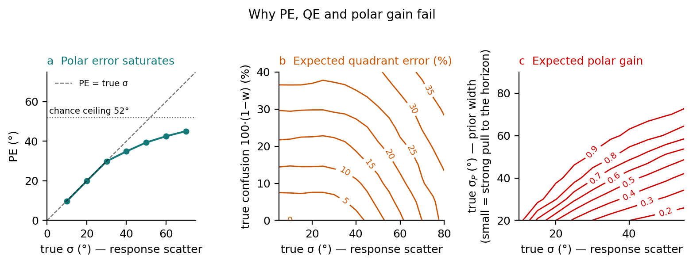

# fa2026-localisation-mixture

[](https://github.com/robaru/fa2026-localisation-mixture/actions/workflows/ci.yml)
[](LICENSE)

A probabilistic mixture model for sound localisation in the median plane.
Companion code for J. Sztandera, L. Picinali and R. Barumerli, *A Probabilistic
Mixture Model for Evaluating Sound Localisation Performance in the Median
Plane*, Forum Acusticum 2026, Graz.

> [!TIP]
> **IMPORTANT — polar gain fix (October 2026).** The selective iterative regression behind `polar_gain()` / `gainP` never re-selected responses that crossed into the other hemifield (e.g. overshoots past 90° for targets near overhead), contrary to Macpherson & Middlebrooks (2003). Polar gain was therefore underestimated: 18 of the 33 AXD listeners in [04](04_axd_prior.ipynb) change, all upwards, by 0.11 on average (up to 0.35).
> `polar_gain()` now follows the paper and notebooks 04 and 05 have been re-run. In 04 the link between σ_P and polar gain still holds: Pearson r = 0.69 → 0.63 (p < .001), Spearman ρ = 0.68 → 0.70.

## Why

Median-plane localisation is usually summarised by polar error (PE), quadrant
error (QE) and polar gain. Each is computed after a hard threshold on the
responses, so none of them reads out a single property of the listener:



- **a** PE drops every error beyond 90°, so it follows the response scatter only
  up to about 30° and then saturates.
- **b** QE counts scatter as front–back confusions: its contours bend, so the
  same QE comes from few confusions with large scatter or many confusions with
  little scatter.
- **c** Polar gain cannot tell a precise listener pulled towards the horizon
  from an imprecise listener with a weaker pull.

The mixture model fits the whole polar response distribution instead and
recovers confusions, scatter and the pull towards the horizon as separate
parameters. The simulations are in
[05_metric_failure_cases.ipynb](05_metric_failure_cases.ipynb).

## The model

For a target at polar angle φ_t, the response φ follows

```
p(φ | φ_t) ∝ [ w·VM(φ; φ_t, κ) + (1 − w)·VM(φ; π − φ_t, κ) ] × [ ½·VM(φ; 0, κ_P) + ½·VM(φ; π, κ_P) ]
```

where VM is the von Mises density.

| Parameter | Reported as | Meaning | Replaces |
|---|---|---|---|
| w | confusion rate 1 − w | probability of responding in the correct front/back hemifield | quadrant error |
| κ | σ (degrees) | scatter of the polar response | polar error |
| κ_P | σ_P (degrees) | width of a prior pulling responses towards the horizontal plane | polar gain |

The likelihood is analytic (a product of von Mises densities is a mixture of
von Mises densities), so a fit with
[pyBADS](https://github.com/acerbilab/pybads) takes a fraction of a second.
With κ_P → 0 the model reduces to the two-parameter mixture (w, κ).

## Quickstart

```bash
git clone https://github.com/robaru/fa2026-localisation-mixture.git
cd fa2026-localisation-mixture
pip install -r requirements.txt        # Python ≥ 3.11; or: conda env create -f environment.yml
```

```python
import pandas as pd
from bayesian_metric import fit_mixture_with_prior

df = pd.read_csv('data/AXD_measured.csv')
fit = fit_mixture_with_prior(df[df['participant'] == 'P0181'])
print(f"confusions {fit['confusion_pct']:.1f} %  sigma {fit['sigma_hat']:.1f} deg  "
      f"sigma_prior {fit['sigma_prior_hat']:.1f} deg  (n = {fit['n_trials']})")
# confusions 20.5 %  sigma 18.3 deg  sigma_prior 18.1 deg  (n = 123)
```

Angles are in degrees in horizontal-polar coordinates (0 in front, 90 above,
180 behind); only targets within ±30° lateral are used. `fit_mixture_querr`
fits the two-parameter model. The same fit and the classical metrics are also
available on `pyfar.Coordinates` through `metrics.localization_error(targets,
responses, 'mixture_model')`; `metrics.describe_metrics()` lists them all.
`metrics.py` is a trimmed copy of the one in
[bayesian_listener](https://github.com/robaru/bayesian_listener).

## Reproducing the paper

Run the notebooks from the repository root. Outputs are committed, so they
render on GitHub as they are.

| Notebook | Content |
|---|---|
| [01](01_axd_behavioral_metrics.ipynb) | Classical metrics and the two-parameter fit for every AXD listener; parameter recovery |
| [02](02_saturation_analysis.ipynb) | Why polar error saturates while σ does not |
| [03](03_prior_recovery.ipynb) | Recovery of (w, κ, κ_P) from synthetic listeners |
| [04](04_axd_prior.ipynb) | Three-parameter fit to the AXD listeners, BIC comparison, σ_P against polar gain |
| [05](05_metric_failure_cases.ipynb) | Synthetic listeners the classical metrics cannot tell apart; the figure above |

The data are the *Measured* condition of the AXD dataset (Imperial College
London, 34 listeners, 5742 trials); see [data/README.md](data/README.md).

## Citation

```bibtex
@inproceedings{sztandera2026mixture,
  title     = {A Probabilistic Mixture Model for Evaluating Sound Localisation Performance in the Median Plane},
  author    = {Sztandera, Jakub and Picinali, Lorenzo and Barumerli, Roberto},
  booktitle = {Proceedings of Forum Acusticum 2026},
  address   = {Graz, Austria},
  year      = {2026}
}
```

Supported by the Marie Skłodowska-Curie Postdoctoral Fellowship MIA (No.
101201118) and the Horizon 2020 project SONICOM (No. 101017743). Licensed under
[GPL-3.0](LICENSE).
